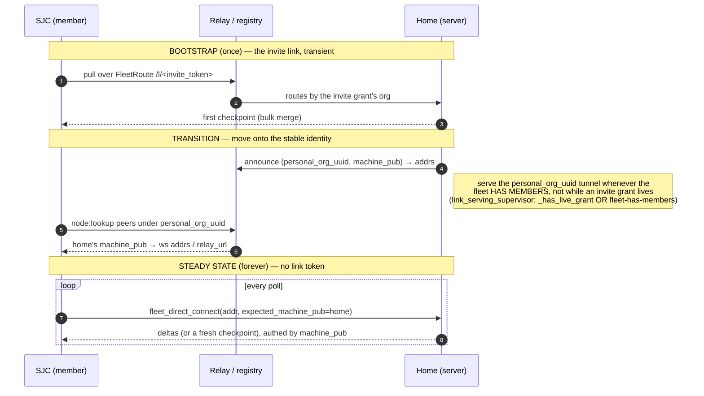

# A new machine joins the fleet — every step, every key, every file

*2026-08-23. The end-to-end sequence for a fresh machine (e.g. SJC) joining the
operator's personal fleet and synchronizing the personal database — and why the
credential expires. Grounded in the canonical notes (`graph read`):
`e2de97e8-630` enrollment recipe, `0c655045-ee4` roster, `964aab90-40e` vault
theory-of-operation, `82e3bdd4-667` vault wake sequence, `1b1e3df3-f43`
root-provisioning registry, `ac81cc06-18e` rendezvous wire contract,
`4a67d019-017` personal-as-org tunnel, `65e49c78-f53` roster-designated serving,
and the sync contract `tools/network/fleet_sync_sim/ALPHA-1.0.md` — plus a
file-level trace of the code.*

## The one mental model

A **fleet = the set of machines holding one operator's personal root.** All
authority is a signature by the **personal root seed**, which lives **only in a
browser while the armor is open** and is **zeroed after every signature**. No
dashboard *server* process ever holds the root seed. Everything a server holds
is either public root-signed evidence or a short-lived derived credential.

The key hierarchy (each arrow = a derivation or a signature):

```
password / passkey factors
   └─ unwrap  PERSONAL-ROOT ARMOR ──────────────► personal root seed   (browser only, zeroed after use)
                                                       │
                    ┌──────────────────────────────────┼───────────────────────────────┐
     derive (HKDF, salt autonomy.identity.machine.v1, info=machine_id)      sign (root-direct)
                    ▼                                                                    ▼
             MACHINE KEY (Ed25519, per machine)                              REACHABILITY CERT
             = roster machine_pub                                            root → machine_pub
                    │                                                        scope node:announce/node:lookup
        sign (12h delegation cert, domain autonomy.idkit.cert.v1)           org = personal_org_uuid
                    ▼
             PROCESS KEY (ephemeral, per unlock)  scope fleet:sync   ◄── THIS is what expires
```

TTLs (`tools/network/clock.py`): fleet runtime **process delegation = 12h**
(`FLEET_RUNTIME_DELEGATION_TTL_SECONDS`); vault delegate = 12h; reachability node
hint = 1h; registry org binding = 30d. The serve-cert (org tunnel) is a separate
24h-ish session cert. **The thing that lapsed on SJC after the overnight gap was
the 12h fleet process delegation cert** — see the last section.

---

## Diagram 1 — Enrollment (invite → durable machine identity)

```mermaid
sequenceDiagram
    autonumber
    actor OpH as Operator @ HOME browser
    participant Home as HOME dashboard (server)
    participant Relay as Relay / Registry
    actor OpS as Operator @ SJC browser
    participant SJC as SJC dashboard (server)

    Note over OpH,Home: PHASE 1 — mint the invite  (needs UNLOCK)
    OpH->>Home: POST /api/approvals kind=link_publish target_type=fleet:join
    Home->>Relay: publish grant (create_link over serving tunnel)
    Relay-->>Home: grant_token + rendezvous https://…/l/<token>
    Note right of Home: grant row → set autonomy.network.link-grant
    OpH->>OpH: openRoot() unlock → personalRootSeed (browser)
    OpH->>OpH: mintFleetInvite() sign body under<br/>autonomy.network.fleet-invite.v1  (seed zeroed)
    Note right of OpH: FleetInvite = {personal_root_pub, rendezvous,<br/>invite_id, expires_at, signature}<br/>bootstrap code = base64url(body).checksum
    OpH->>Home: POST /api/fleet/invitations/register {invite, grant_token}
    Note right of Home: bound in machine.db fleet_enrollment_invites

    Note over OpS,SJC: PHASE 2 — new machine consumes the invite at boot
    OpS->>SJC: install with env AUTONOMY_FLEET_INVITE=<code>
    SJC->>SJC: machine_boot.mark_joining_from_env<br/>(fails CLOSED on serving until enrolled)
    Note right of SJC: set autonomy.machine.fleet-joining (machine.db)
    SJC->>SJC: mint RANDOM machine_id (os.urandom(32)) — public, not a key
    SJC->>SJC: build EnrollmentRequest {machine_id, personal_root_pub, invite_id}<br/>SAS = verification_code, request_id = hash(request)
    SJC->>Relay: fleet.request over ViewerChannel /l/<token>
    Relay->>Home: (routes to home's serving tunnel)
    Home->>Home: open_request → resume_token, channel_binding=hash(resume_token)
    Note right of Home: pending row → machine.db fleet_enrollment_pending<br/>approval "fleet-"+request_id → approval_requests.db
    Home-->>SJC: {status:pending, request_id, verification_code, resume_token}
    SJC->>SJC: save recovery → machine.db fleet_enrollment_join_state<br/>(no machine key stored)

    Note over OpH,Home: PHASE 3 — admission approval  (needs UNLOCK)
    Home-->>OpH: approval card shows SAS verification_code
    OpH->>OpS: compare SAS out-of-band — THE security boundary
    OpH->>OpH: openRoot() → derive machine key HKDF(seed, machine_id)
    OpH->>OpH: sign RosterEntry (kind=enroll, assignment=personal_root_holder)<br/>under autonomy.fleet.roster-entry.v1<br/>+ sign transient EnrollmentApproval (binds channel_binding)
    OpH->>Home: decision {approval, roster_entry}  (public records only)
    Home->>Home: verify sigs vs personal-root anchor; store_entry
    Note right of Home: RosterEntry → set autonomy.fleet.roster (personal.db, band raw)<br/>verdict stays only in approval_requests.db

    Note over OpS,SJC: PHASE 4 — delivery + completion
    SJC->>Relay: fleet.resume {request_id, resume_token}
    Relay->>Home: (routes)
    Home-->>SJC: EnrollmentDelivery {approval, roster_entry,<br/>roster_entries (origin+joiner), personal_root_armor}
    Note right of SJC: store armor → set autonomy.identity.personal (personal.db)<br/>save delivery → machine.db fleet_enrollment_join_state
    OpS->>SJC: openRoot() unlock (completion)
    SJC->>SJC: re-derive machine key; verify roster authorizes this machine<br/>sign completion proof under autonomy.fleet.enrollment-completion.v1
    SJC->>SJC: verify_bootstrap_roster: exactly one ORIGIN + this joiner
    Note right of SJC: write roster entries → autonomy.fleet.roster (personal.db)<br/>FleetRoute{rendezvous, origin_machine_pub} → autonomy.fleet-route (machine.db)<br/>durable machine_id → autonomy.machine.identity (machine.db)  ← now ENROLLED
```

**What the machine holds after enrollment:** the encrypted **personal-root
armor** (openable only with the operator's password/passkey), its durable public
**machine_id**, and the **roster** (its own ENROLL entry + the origin). It stores
**no machine key** — the machine key is re-derived on demand from the unlocked
root seed (`derive_machine_key`, HKDF). See canonical `e2de97e8-630`,
`0c655045-ee4`, `ac81cc06-18e`.

---

## Diagram 2 — Runtime activation, startup, and the sync pull

```mermaid
sequenceDiagram
    autonumber
    actor OpS as Operator @ SJC browser
    participant SJC as SJC dashboard (server)
    participant Sched as SJC fleet-sync scheduler (in-process)
    participant Relay as Relay
    participant Home as HOME serving connector

    Note over OpS,SJC: PHASE 5 — runtime activation  (EVERY unlock; nothing here persists)
    OpS->>OpS: openRoot() → derive machine key
    OpS->>OpS: mint PROCESS KEY + delegation cert (machine→process,<br/>scope fleet:sync, TTL 12h) [+ reachability cert if personal org registered]
    OpS->>SJC: POST /api/fleet/runtime {machine_id, machine_pub,<br/>process_private_seed, delegation_cert, reachability_cert?}
    SJC->>SJC: _activate_runtime: verify cert chains from roster machine key
    SJC->>Sched: configure_dashboard_fleet_sync(config with process key + cert)
    Note right of Sched: the scheduler is rebuilt with the fresh credential
    Note over SJC: NOTHING persisted (fleet_runtime.py) —<br/>a restart or the 12h expiry needs another unlock

    Note over SJC: PHASE 6 — container startup / boot (what a restart does)
    SJC->>SJC: portability.main → migrate_on_mount → first_run.initialize_data_root
    Note right of SJC: creates data dir + operational DBs; stamps volume version<br/>(the org-DB "migration" walk is DELETED — 2026-08-23)
    SJC->>SJC: restore_vault_across_hot_reload (ramfs) — re-warms VAULT only
    SJC->>Sched: DashboardFleetSyncService.start() — starts UNCONFIGURED
    Note right of Sched: the fleet PROCESS credential is NOT in the ramfs snapshot →<br/>after any restart the loop has no cert until the next unlock  (auto-oj5pt)

    Note over Sched,Home: PHASE 7 — the sync pull (once armed on BOTH sides)
    loop every ~poll_interval, per active roster peer
        Sched->>Relay: GET /l/<token>/envelope ; open ViewerChannel
        Sched->>Sched: build_client_hello(token) — signs with the PROCESS delegation cert
        Sched->>Home: fleet.sync.pull {roster_epoch, checkpoint, hello}
        Home->>Home: check_grant(token) fleet:join ; connector_runtime.handle()
        Note right of Home: needs the serving connector ARMED (its own 12h process cred)
        Home->>Home: build checkpoint from personal.db (ALPHA-1.0):<br/>freeze WAL cut → stream base (settings skip deprecated!) → winners metadata
        Home-->>Sched: server-hello → checkpoint.begin → RaptorQ symbols → deltas
        Sched->>Sched: reconstruct → verify → install into personal.db (bulk MERGE, LWW)
    end
```

The base snapshot is the **entire logical personal graph** (sources, thoughts,
entities, claims, edges, note history, comments, tags, threads, captures,
attachment metadata, Settings) — **except** `autonomy.identity.personal` /
`autonomy.identity.passkey` and derived FTS. Applied as a **bulk merge, never a
snapshot-replace**; every row carries its own timestamp (LWW). See ALPHA-1.0.md,
`1155b8f4-8cf`.

---

## Bootstrap → steady-state: the invite link is not the fleet

**The invite link is bootstrap only, and it is designed to die.** A joiner's
`FleetRoute.rendezvous` is the `fleet:join` relay link (`.../l/<token>`). That
grant is transient — a fixed TTL (7 days) and it is the *invitation*, not the
fleet. A fleet that keeps synchronizing over the invite link stops the moment
the grant lapses or the serving gate drops it: the relay returns
`4404 CLOSE_UNKNOWN_LINK` (`relay.py:69`) because no tunnel is registered for the
org, even though the link envelope still resolves.

**Everything a fleet needs to find itself is stable and never changes:**

- **`personal_org_uuid = uuid5(fixed_ns, personal_root_pub)`** — the fleet's own
  org id, deterministic from the root.
- **`machine_id` / `machine_pub`** — each member's durable identity.

The reachability layer is built on exactly these: `node:announce` /
`node:lookup` store `(personal_org_uuid, machine_pub) → {ws addrs, relay_url}`
in the registry's `node_hints`, and `fleet_direct_connect(addr,
expected_machine_pub=…)` dials a **specific machine** — no link token anywhere.

So the intended lifecycle has two phases, and the transition is the load-bearing
step:



**Two invariants this requires (both operator directives, 2026-08-23):**

1. **The serving tunnel must stay online while the fleet has members.** Home
   registers its tunnel under `personal_org_uuid` and keeps it up on
   *membership*, not on a transient invite grant. Implemented in
   `link_serving_supervisor._reconcile`: `should_run` is satisfied by
   `_has_live_grant(org)` **OR** (the personal fleet has ≥2 active roster
   members). A stable tunnel under the stable org id is what `node:lookup` finds.
2. **Ongoing sync must route on `(personal_org_uuid, machine_id)`, not the invite
   link.** The steady-state path (`fleet_sync_scheduler` → `peer_addresses` from
   the `ReachabilityCache` → `fleet_direct_connect`) is machine-addressed and
   link-independent, so it survives past any grant lifetime.

**Current gap / remaining work:** a freshly bootstrapped member can stay stuck on
the `fleet_relay_sync` invite-link path and never hand off to the reachability
mesh — if home stops serving (invite grant gone) the member 4404s instead of
re-finding home by `machine_pub`. Closing this = (a) invariant #1 (done — the
membership serving gate), and (b) invariant #2: retire the `FleetRoute` invite
rendezvous once reachability has resolved the origin's `machine_pub`, so the pull
runs on the stable identity. Until (b) lands, keep the invite grant alive (or the
membership gate serving) so the bootstrap link keeps routing.

---

## Why the certificate expires, and who is supposed to refresh it

The credential the sync loop signs its client-hello with is the **fleet process
delegation cert**: `machine key → process key`, scope `fleet:sync`, **TTL 12
hours** (`FLEET_RUNTIME_DELEGATION_TTL_SECONDS`, `tools/network/clock.py`). It is
short-lived on purpose — a stolen process key is time-bounded — and it is
**minted only in the browser at unlock** (the machine key comes from the personal
root, which only the browser has). **Nothing re-mints it before expiry.**

So the observed failure is exactly this: SJC was armed the night before; ~12h
later `build_client_hello` threw
`HandshakeError: fleet runtime delegation failed: hop 1: expired at <t>`. Its own
client cert had lapsed. A fresh unlock on SJC re-mints it — **but** a second bug
compounds it: the already-running scheduler cached the old credential and the
reconfigure did not always hot-swap it (same class as the serving connector),
so a restart was needed to pick up the new one.

**Who *should* refresh it (the fix, `auto-oj5pt`).** The canonical
root-provisioning registry `1b1e3df3-f43` already classifies the fleet runtime
credential as **Table A "ambient material that must stay warm across a hot
reload,"** and names the disease: these group-A steps "were re-run blindly per
unlock and were neither persistent nor idempotent." The fix is the same shape as
the vault's own warm-reload hand-off (`save/restore_vault_across_hot_reload`):

- **Hot reload** → carry the process credential in the ramfs snapshot, so the
  loop keeps it.
- **Cold start (ramfs gone)** → recover it from a **vaulted, audited setting in
  machine.db** as soon as the first login warms the personal vault (see
  `musings/fleet-multi-tunnel-routing-and-vaulted-serving-keys-2026-08-23.md`).
- Re-mint only when the cert genuinely expires (the 12h/rotation cadence), never
  on every restart.

Until that lands, both sides (home serving connector **and** SJC's pull loop)
must be armed by an unlock, and neither survives a process restart — which is
the entire "unlock treadmill."

## The two startup bugs found on the way (both fixed 2026-08-23)

1. **Migration on mount.** `first_run._migrate_all_org_dbs` walked every
   `orgs/*.db` on each mount to "migrate" it; with nothing shipped there is
   nothing to migrate, and it crash-looped on an empty `orgs/personal.db` stub
   (`GraphDBNotReady`, unhandled at startup). **Deleted.**
2. **The stub itself — where it really came from.** `"personal"` and
   `"machine"` ARE reserved local-store keywords (`LOCAL_STORE_SLUGS =
   ("personal","machine")`), so `_org_db_path("personal")` resolves
   **target-first** to `<data>/personal.db` (never `orgs/personal.db`) and no
   org may be named either (`org_ops.py:188`). No routed caller can ever create
   `orgs/personal.db`; the resolver only *returns* the legacy orgs path when it
   already exists. The 0-byte `orgs/personal.db` was created **by the manual
   local-store relocation runbook** (`DEPLOY.md:253-256`):
   `sqlite3 data/orgs/personal.db "PRAGMA journal_mode=DELETE;"` — that `sqlite3`
   invocation *opens and therefore creates* the path. Run once more after the
   store was already moved to `data/personal.db` (or a double-pasted line), it
   recreates a **fresh 0-byte** `data/orgs/personal.db` (a schema-less
   `journal_mode` pragma writes no pages). That is the exact observed pair. The
   now-deleted `_migrate_all_org_dbs` raw-globbed `orgs/*.db` with **no error
   handling** and tripped over it (`GraphDBNotReady` on the read-only-mount path;
   on a writable mount it would instead silently schema-init the stub). With the
   migration gone, every remaining reader either routes to the real
   `data/personal.db` or wraps org-DB opens in `except sqlite3.Error`, so the
   stub is inert. Follow-ups worth a bead: the `DEPLOY.md` relocation step
   should be idempotent / guard against recreating the stub, and `fleet_doctor`
   already detects this "both homes exist" damage (added 2026-08-22).
