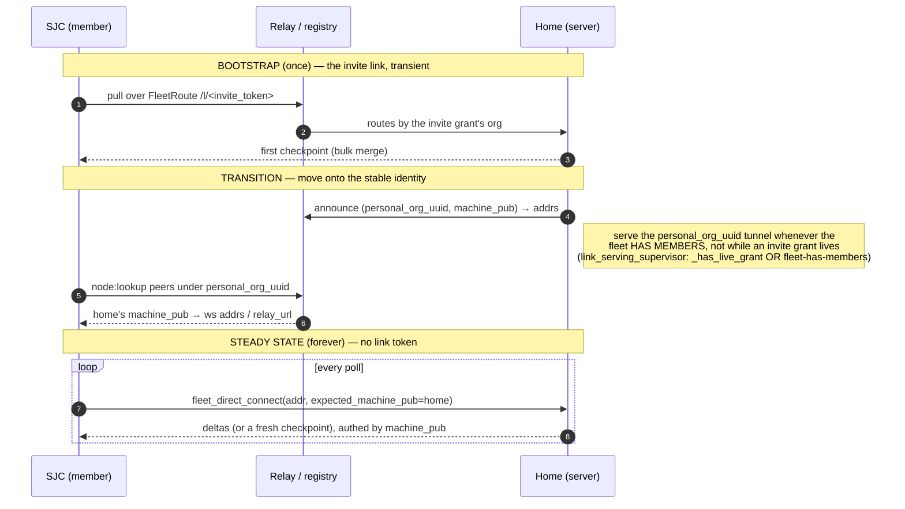

# A new machine joins the fleet — every step, every key, every file

*2026-08-23. The end-to-end sequence for a fresh machine (e.g. SJC) joining the
operator's personal fleet and synchronizing the personal database — and why the
credential expires. Grounded in the canonical notes (`graph read`):
`e2de97e8-630` enrollment recipe, `0c655045-ee4` roster, `964aab90-40e` vault
theory-of-operation, `82e3bdd4-667` vault wake sequence, `1b1e3df3-f43`
root-provisioning registry, `ac81cc06-18e` rendezvous wire contract,
`4a67d019-017` personal-as-org tunnel, `65e49c78-f53` roster-designated serving,
and the sync contract `tools/network/fleet_sync/ALPHA-1.0.md` — plus a
file-level trace of the code.*

## The one mental model

A **fleet = the set of machines holding one operator's personal root.** All
authority is a signature by the **personal root seed**, which lives **only in a
browser while the armor is open** and is **zeroed after every signature**. No
dashboard *server* process ever holds the root seed. Everything a server holds
is either public root-signed evidence or a short-lived derived credential.

The key hierarchy (each arrow = a derivation or a signature):

```
password / passkey factors
   └─ unwrap  PERSONAL-ROOT ARMOR ──────────────► personal root seed   (browser only, zeroed after use)
                                                       │
                    ┌──────────────────────────────────┼───────────────────────────────┐
     derive (HKDF, salt autonomy.identity.machine.v1, info=machine_id)      sign (root-direct)
                    ▼                                                                    ▼
             MACHINE KEY (Ed25519, per machine)                              REACHABILITY CERT
             = roster machine_pub                                            root → machine_pub
                    │                                                        scope node:announce/node:lookup
        sign (12h delegation cert, domain autonomy.idkit.cert.v1)           org = personal_org_uuid
                    ▼
             PROCESS KEY (ephemeral, per unlock)  scope fleet:sync   ◄── THIS is what expires
```

TTLs (`tools/network/clock.py`): fleet runtime **process delegation = 12h**
(`FLEET_RUNTIME_DELEGATION_TTL_SECONDS`); vault delegate = 12h; reachability node
hint = 1h; registry org binding = 30d. The serve-cert (org tunnel) is a separate
24h-ish session cert. **The thing that lapsed on SJC after the overnight gap was
the 12h fleet process delegation cert** — see the last section.

---

## Diagram 1 — Enrollment (invite → durable machine identity)

```mermaid
sequenceDiagram
    autonumber
    actor OpH as Operator @ HOME browser
    participant Home as HOME dashboard (server)
    participant Relay as Relay / Registry
    actor OpS as Operator @ SJC browser
    participant SJC as SJC dashboard (server)

    Note over OpH,Home: PHASE 1 — mint the invite  (needs UNLOCK)
    OpH->>Home: POST /api/approvals kind=link_publish target_type=fleet:join
    Home->>Relay: publish grant (create_link over serving tunnel)
    Relay-->>Home: grant_token + rendezvous https://…/l/<token>
    Note right of Home: grant row → set autonomy.network.link-grant
    OpH->>OpH: openRoot() unlock → personalRootSeed (browser)
    OpH->>OpH: mintFleetInvite() sign body under<br/>autonomy.network.fleet-invite.v1  (seed zeroed)
    Note right of OpH: FleetInvite = {personal_root_pub, rendezvous,<br/>invite_id, expires_at, signature}<br/>bootstrap code = base64url(body).checksum
    OpH->>Home: POST /api/fleet/invitations/register {invite, grant_token}
    Note right of Home: bound in machine.db fleet_enrollment_invites

    Note over OpS,SJC: PHASE 2 — new machine consumes the invite at boot
    OpS->>SJC: install with env AUTONOMY_FLEET_INVITE=<code>
    SJC->>SJC: machine_boot.mark_joining_from_env<br/>(fails CLOSED on serving until enrolled)
    Note right of SJC: set autonomy.machine.fleet-joining (machine.db)
    SJC->>SJC: mint RANDOM machine_id (os.urandom(32)) — public, not a key
    SJC->>SJC: build EnrollmentRequest {machine_id, personal_root_pub, invite_id}<br/>SAS = verification_code, request_id = hash(request)
    SJC->>Relay: fleet.request over ViewerChannel /l/<token>
    Relay->>Home: (routes to home's serving tunnel)
    Home->>Home: open_request → resume_token, channel_binding=hash(resume_token)
    Note right of Home: pending row → machine.db fleet_enrollment_pending<br/>approval "fleet-"+request_id → approval_requests.db
    Home-->>SJC: {status:pending, request_id, verification_code, resume_token}
    SJC->>SJC: save recovery → machine.db fleet_enrollment_join_state<br/>(no machine key stored)

    Note over OpH,Home: PHASE 3 — admission approval  (needs UNLOCK)
    Home-->>OpH: approval card shows SAS verification_code
    OpH->>OpS: compare SAS out-of-band — THE security boundary
    OpH->>OpH: openRoot() → derive machine key HKDF(seed, machine_id)
    OpH->>OpH: sign RosterEntry (kind=enroll, assignment=personal_root_holder)<br/>under autonomy.fleet.roster-entry.v1<br/>+ sign transient EnrollmentApproval (binds channel_binding)
    OpH->>Home: decision {approval, roster_entry}  (public records only)
    Home->>Home: verify sigs vs personal-root anchor; store_entry
    Note right of Home: RosterEntry → set autonomy.fleet.roster (personal.db, band raw)<br/>verdict stays only in approval_requests.db

    Note over OpS,SJC: PHASE 4 — delivery + completion
    SJC->>Relay: fleet.resume {request_id, resume_token}
    Relay->>Home: (routes)
    Home-->>SJC: EnrollmentDelivery {approval, roster_entry,<br/>roster_entries (origin+joiner), personal_root_armor}
    Note right of SJC: store armor → set autonomy.identity.personal (personal.db)<br/>save delivery → machine.db fleet_enrollment_join_state
    OpS->>SJC: openRoot() unlock (completion)
    SJC->>SJC: re-derive machine key; verify roster authorizes this machine<br/>sign completion proof under autonomy.fleet.enrollment-completion.v1
    SJC->>SJC: verify_bootstrap_roster: exactly one ORIGIN + this joiner
    Note right of SJC: write roster entries → autonomy.fleet.roster (personal.db)<br/>FleetRoute{rendezvous, origin_machine_pub} → autonomy.fleet-route (machine.db)<br/>durable machine_id → autonomy.machine.identity (machine.db)  ← now ENROLLED
```

**What the machine holds after enrollment:** the encrypted **personal-root
armor** (openable only with the operator's password/passkey), its durable public
**machine_id**, and the **roster** (its own ENROLL entry + the origin). It stores
**no machine key** — the machine key is re-derived on demand from the unlocked
root seed (`derive_machine_key`, HKDF). See canonical `e2de97e8-630`,
`0c655045-ee4`, `ac81cc06-18e`.

---

## Diagram 2 — Runtime activation, startup, and the sync pull

```mermaid
sequenceDiagram
    autonumber
    actor OpS as Operator @ SJC browser
    participant SJC as SJC dashboard (server)
    participant Sched as SJC fleet-sync scheduler (in-process)
    participant Relay as Relay
    participant Home as HOME serving connector

    Note over OpS,SJC: PHASE 5 — runtime activation  (EVERY unlock; nothing here persists)
    OpS->>OpS: openRoot() → derive machine key
    OpS->>OpS: mint PROCESS KEY + delegation cert (machine→process,<br/>scope fleet:sync, TTL 12h) [+ reachability cert if personal org registered]
    OpS->>SJC: POST /api/fleet/runtime {machine_id, machine_pub,<br/>process_private_seed, delegation_cert, reachability_cert?}
    SJC->>SJC: _activate_runtime: verify cert chains from roster machine key
    SJC->>Sched: configure_dashboard_fleet_sync(config with process key + cert)
    Note right of Sched: the scheduler is rebuilt with the fresh credential
    Note over SJC: NOTHING persisted (fleet_runtime.py) —<br/>a restart or the 12h expiry needs another unlock

    Note over SJC: PHASE 6 — container startup / boot (what a restart does)
    SJC->>SJC: portability.main → migrate_on_mount → first_run.initialize_data_root
    Note right of SJC: creates data dir + operational DBs; stamps volume version<br/>(the org-DB "migration" walk is DELETED — 2026-08-23)
    SJC->>SJC: restore_vault_across_hot_reload (ramfs) — re-warms VAULT only
    SJC->>Sched: DashboardFleetSyncService.start() — starts UNCONFIGURED
    Note right of Sched: the fleet PROCESS credential is NOT in the ramfs snapshot →<br/>after any restart the loop has no cert until the next unlock  (auto-oj5pt)

    Note over Sched,Home: PHASE 7 — the sync pull (once armed on BOTH sides)
    loop every ~poll_interval, per active roster peer
        Sched->>Relay: GET /l/<token>/envelope ; open ViewerChannel
        Sched->>Sched: build_client_hello(token) — signs with the PROCESS delegation cert
        Sched->>Home: fleet.sync.pull {roster_epoch, checkpoint, hello}
        Home->>Home: check_grant(token) fleet:join ; connector_runtime.handle()
        Note right of Home: needs the serving connector ARMED (its own 12h process cred)
        Home->>Home: build checkpoint from personal.db (ALPHA-1.0):<br/>freeze WAL cut → stream base (settings skip deprecated!) → winners metadata
        Home-->>Sched: server-hello → checkpoint.begin → RaptorQ symbols → deltas
        Sched->>Sched: reconstruct → verify → install into personal.db (bulk MERGE, LWW)
    end
```

The base snapshot is the **entire logical personal graph** (sources, thoughts,
entities, claims, edges, note history, comments, tags, threads, captures,
attachment metadata, Settings) — **except** `autonomy.identity.personal` /
`autonomy.identity.passkey` and derived FTS. Applied as a **bulk merge, never a
snapshot-replace**; every row carries its own timestamp (LWW). See ALPHA-1.0.md,
`1155b8f4-8cf`.

---

## Bootstrap → steady-state: the invite link is not the fleet

**The invite link is bootstrap only, and it is not durable.** A joiner's
`FleetRoute.rendezvous` is the `fleet:join` relay link (`.../l/<token>`). That
grant is transient because it **expires** — a fixed 7-day TTL (`meta.ttl =
604800`) — and it is the *invitation*, not the fleet. A fleet that keeps
synchronizing over the invite link therefore stops permanently once the grant's
TTL elapses.

**Grant lifecycle (authoritative — verified against the code, not the spec):**
the `fleet:join` grant is *published* (`link_publish`), *registered*
(`register_invite`), then used to route the bootstrap pull. It stays live until
**exactly one of two things** happens: its **7-day TTL expires**, or an
**explicit operator revoke** (`graph link revoke` → the `link_revoke` approval →
the relay's `revoke-link` control op, `relay.py:660`). It is **NOT** revoked
automatically by enrollment, by the first roster-authorized handshake, by the
first pull, or by completion — there is no such code anywhere in the enrollment
surface (`fleet_enrollment_service` / `_approvals` / `fleet_enroll` /
`fleet_enrollment_client` / `fleet_enrollment_routes` — zero `revoke`/
`remove-grant` calls). The design note `ac81cc06` states "the first
roster-authorized handshake … revokes the invitation grant"; that line is
**specified but not implemented** — a spec-vs-code gap, recorded here so this
document, not the spec, is the authority.

Home's *serving* of the tunnel is gated on `_has_live_grant` **OR** fleet
membership (invariant #1 below), so serving does not stop when the grant
eventually expires, as long as the fleet has members. (Note: the relay's
`4404 CLOSE_UNKNOWN_LINK` is overloaded across six unrelated conditions —
unknown/expired/revoked link, no tunnel, admission reject, and a **mid-stream
byte-quota throttle** — so a 4404 does *not* by itself mean the grant or tunnel
is gone; a large checkpoint hitting the relay's anti-abuse byte buckets closes
with the same code.)

**Everything a fleet needs to find itself is stable and never changes:**

- **`personal_org_uuid = uuid5(fixed_ns, personal_root_pub)`** — the fleet's own
  org id, deterministic from the root.
- **`machine_id` / `machine_pub`** — each member's durable identity.

The reachability layer is built on exactly these: `node:announce` /
`node:lookup` store `(personal_org_uuid, machine_pub) → {ws addrs, relay_url}`
in the registry's `node_hints`, and `fleet_direct_connect(addr,
expected_machine_pub=…)` dials a **specific machine** — no link token anywhere.

So the intended lifecycle has two phases, and the transition is the load-bearing
step:



**Two invariants this requires (both operator directives, 2026-08-23):**

1. **The serving tunnel must stay online while the fleet has members.** Home
   registers its tunnel under `personal_org_uuid` and keeps it up on
   *membership*, not on a transient invite grant. Implemented in
   `link_serving_supervisor._reconcile`: `should_run` is satisfied by
   `_has_live_grant(org)` **OR** (the personal fleet has ≥2 active roster
   members). A stable tunnel under the stable org id is what `node:lookup` finds.
2. **Ongoing sync must route on `(personal_org_uuid, machine_id)`, not the invite
   link.** The steady-state path (`fleet_sync_scheduler` → `peer_addresses` from
   the `ReachabilityCache` → `fleet_direct_connect`) is machine-addressed and
   link-independent, so it survives past any grant lifetime.

**Current gap / remaining work:** a freshly bootstrapped member can stay stuck on
the `fleet_relay_sync` invite-link path and never hand off to the reachability
mesh — if home stops serving (its live grant expired, or the membership gate is
not yet deployed) the member 4404s instead of re-finding home by `machine_pub`. Closing this = (a) invariant #1 (done — the
membership serving gate), and (b) invariant #2: retire the `FleetRoute` invite
rendezvous once reachability has resolved the origin's `machine_pub`, so the pull
runs on the stable identity. Until (b) lands, keep the invite grant alive (or the
membership gate serving) so the bootstrap link keeps routing.

---

## Landing: joining → member — the completion flag that never flips

The sync completing is **not** the end of onboarding as far as the UI is
concerned, because **no signal the homepage router reads flips on first-sync
completion.** The machine is a fully synced member (382 MB, 645k catalog rows,
`checkpoints_received=1`), yet `page_index` (`tools/dashboard/server.py`) still
routes it into the wrong flow, through two gates that both mis-model a
personal-fleet member:

1. **Harness / bootstrap gate** (`_bootstrap_gate_open`, true while no harness
   row has `auth == "ok"`) → renders **"Set up your assistant"**
   (`bootstrap.html`, "pick the coding assistant"). That is the **new-user
   installation / harness-pick** flow — the wrong audience for a machine that
   just joined a fleet and synced (`auto-d09u9`). A synced member should see its
   dashboard and a fleet-aware "add an assistant when you want to run sessions"
   prompt, not a fresh-machine setup that hides the completed sync.
2. **Welcome gate** (`_welcome_gate_open`, requires personal identity **AND** a
   **collaborative org**) → a personal-only machine has no collaborative org, so
   the gate stays open **forever** and traps it on the Welcome shell, never
   reaching `/beads` via the index (`auto-3my4s`). **Operator ruling: a personal
   database alone must enter the dashboard; joining an org is not a gate.**

Neither gate checks the real completion signal — "is the personal fleet synced."
The fix is a durable **first-sync-done flag** (flipped when the first checkpoint
installs) the router keys on: synced member → dashboard; genuinely fresh machine
→ the install flow. This is the routing half of the fleet status-screen spec
(`auto-p0tut`) and the seam where the fleet-**join** flow (this doc) and the
new-user-**install** flow (the packaging roadmap) must be cleanly separated.

## The parties, and the state each one holds

The workflow has **four** parties, not two. The relay is a stateful participant,
and most of the confusing failures live in *its* state, not the two dashboards'.

| Party | Durable state it holds | Ephemeral / in-memory state |
|---|---|---|
| **Operator browser** (on each machine) | nothing — opens the armored personal root only while unlocked | the **personal root seed** (zeroed after every signature); derives the machine key + mints every cert |
| **Home dashboard + serving connector** | `personal.db` (roster, graph, the `fleet_sync_catalog`), the **serve-cert** (0600 key file + Settings row, 30d), the durable `machine_id` | the **fleet runtime process cert** (12h→30d, memory-only today — `auto-oj5pt`), the configured **fleet-sync scheduler**, and the **tunnel-serve WS** it holds open to the relay |
| **Relay / registry** (`relay.auto.network`) | `links` table (per-token grants: `revoked_at`, `expires_at`), `node_hints` (reachability: `(org_uuid, machine_pub)→addrs`, TTL'd) | **`TunnelHub`** — one live tunnel **per org_uuid**, in-memory, last-writer-wins (`CLOSE_REPLACED 4409`); per-channel/-link **abuse byte buckets** + admission windows |
| **SJC dashboard** (the joiner/member) | `machine.db` (its `machine_id`, join recovery, `FleetRoute`), `personal.db` (synced) | its pull loop, the `ReachabilityCache`, and (once armed) its own fleet runtime cert |

**Two independent "is home serving?" facts that this workflow kept conflating:**

1. **Home's local serving state** — the connector process is alive, `serve_cert_ok`, `_has_live_grant`/membership true. This is what `fleet_doctor` / the control socket report.
2. **The relay's hub state** — whether home's tunnel-serve **WS is currently registered in `TunnelHub` for the org**. This is what actually routes a viewer.

(1) can be true while (2) is false (the WS dropped, or was `4409`-replaced by a duplicate connector). A viewer only cares about (2). Diagnose the relay's hub, not home's flag.

## Networking pipes — control plane, data plane, and which tunnel carries the sync

Three distinct pipes, and the confusion is that two of them **share one channel**.

**1. Registry (`registry.auto.network`) — out-of-band control / discovery only.**
`node:announce` / `node:lookup` store and resolve `(org_uuid, machine_pub) →
addresses`. This is the ~45s `reachability/query` in SJC's logs: pure peer
discovery by stable identity, plus roster/binding/epoch metadata. **It never
carries checkpoint bytes.**

**2. Relay (`relay.auto.network`) — the rendezvous + NAT-traversal tunnel that
carried THIS bring-up's sync.** Home holds a **tunnel-serve WebSocket** open to
the relay; the relay's `TunnelHub` registers it **one-per-`org_uuid`**. SJC dials
the relay **link token** (`/l/<token>`); the relay routes the dial through the
hub to home's serve WS, opening a bidirectional **`ViewerChannel`**. **Control
and data are MULTIPLEXED on this one channel:** `pull_checkpoint_once` sends
`{op: PULL, hello, checkpoint: true}` (control), then `recv_message_stream()`
yields `fleet.server-hello` (control) followed by `checkpoint.begin` → per-file
frames (**the 382 MB of data**) → `checkpoint.end`. Same socket. That is exactly
why the anti-abuse **byte limiter** (a data-plane concern) and the **`4404`
close** (control-plane) both surfaced on one channel and were conflated. This
path exists because **home is behind NAT** — the relay is the only way SJC
reaches home's serving process today.

**3. Direct tunnel (`fleet_direct_connect`) — the steady-state path that
bypasses the relay.** Once pipe 1 resolves home's address + `machine_pub`, SJC
can dial home **directly** (`fleet_sync_scheduler` / `peer_addresses`), same
fleet protocol, no relay in the middle — the stable-identity route the invite
link is meant to hand off to (see "Bootstrap → steady-state"). In this bring-up
the sync rode **pipe 2**; direct-dial is the target once reachability is wired
end to end.

**Where the signal is vs where the data is:**
- **Discovery / signal** → registry (pipe 1), out of band.
- **Session control** (hello handshake, roster-epoch check, `PULL` op,
  server-hello) → multiplexed on the sync channel (pipe 2 or 3).
- **Bulk data** (the checkpoint) → the same sync channel, after the hello.
- **Statistics** → **neither** a signal nor replicated data today. Each machine
  writes its own transfer counters into the **local, non-replicated**
  `fleet_sync_peer_state` as a **side effect** of a transfer and renders its
  **own** copy — the card's "Observed here". Nothing about stats crosses the
  wire, which is precisely why home and SJC disagree and why a dropped
  connection loses the count (the Never / 0 B screenshot on a committed 382 MB
  sync). The intended design moves stats **into the replicated data plane** as a
  per-machine setting (`auto-eqcio`), so status is a pure **local query of
  synced data** — no messaging, no side-channel accounting, no divergence.

## Failure-mode catalog

Every mode observed bringing SJC into the fleet, by layer. "Fixed" cites the
commit; "gap" is tracked work.

### Relay / registry
| Symptom | Root cause | Resolution |
|---|---|---|
| all connects fail; relay `/healthz` down | relay crash-loop — `deploy.sh` rsyncs only `tools/network/{idkit,relaykit,registry}`, never top-level `clock.py` that `assertion.py` imports | scp `clock.py` + restart; **gap:** fix `deploy.sh` to sync the whole `tools/network` tree |
| `4404 CLOSE_UNKNOWN_LINK` at **dial** | one of: unknown/expired/revoked token, **or** `hub.get(org_uuid) is None` (no tunnel), **or** admission-window reject | deliberately uniform to the client (anti-enumeration); **must** be logged server-side per branch |
| `4404` **mid-stream** (fails inside `recv_message_stream`) | the anti-abuse **byte-rate limiter** (`try_enqueue → charge_bytes`) closes with the same 4404 when a transfer exceeds the buckets (**channel 16 MB burst / 8 MB/s, link 64 MB burst / 32 MB/s**) — and a full personal.db checkpoint is **574 MiB** | **gap:** exempt authenticated `fleet:join` channels from the byte limiter (bounded already by `MAX_CHECKPOINT_BYTES`); and stop reusing 4404 |
| home's tunnel flaps in/out of the hub | `CLOSE_REPLACED 4409` — a **duplicate connector** for the same org keeps registering, booting the other | ensure exactly one serving connector per org |
| six failure modes indistinguishable | `CLOSE_UNKNOWN_LINK 4404` overloaded across all of the above | **gap:** distinct close codes for post-authentication conditions (keep dial-time uniform for anti-enumeration) |

### Home serving (connector)
| Symptom | Root cause | Resolution |
|---|---|---|
| SJC sees "fleet server hello envelope is malformed" | home's `connector_runtime.scheduler is None` → "serving machine is locked for Fleet sync" (no server-hello) | arm via unlock → `publish_connector_runtime`; **gap:** persist the runtime cert (`auto-oj5pt`) so a restart re-arms |
| unlock returns 200 but connector still unarmed | `configure()` rejected the credential (`org_uuid` unresolved) — silently | fixed `56a3442d` (resolve `org_uuid` from binding) + `eda69e3f` (surface the error) |
| tunnel torn down after enrollment | `_reconcile` required `_has_live_grant`; the invite grant is transient | fixed `338f26bc` — serve on **fleet membership** OR a live grant |
| connector dies on every reload, needs re-unlock | fleet runtime cert is memory-only; `uvicorn --reload` (or any restart) drops it | **gap:** `auto-oj5pt` — persist + warm-restore + `RENEW_BELOW_DAYS` refresh |
| unlock stalls the event loop ~24s | the 700K-row `_verify_catalog_integrity` ran synchronously on the loop each unlock | early-skip when already active |

### Checkpoint build (home)
| Symptom | Root cause | Resolution |
|---|---|---|
| `AlphaError: checkpoint contains untracked logical rows` | `tracked_live != base.total_records` — 274 **deprecated duplicate settings base rows** streamed by the snapshot | fixed `f7c1996d` — skip `deprecated` base rows in the settings enumeration |
| same AlphaError, off by exactly 1 | a settings row deprecated in **May** left a `tombstone=0` catalog orphan (deprecation never tombstoned the catalog) | tombstone the one orphan; **gap:** extend `reconcile_catalog` to tombstone orphaned-live entries |
| catalog incomplete after activation | the SQLite < 3.38 `RETURNING`-on-upsert bug (host runs 3.37.2) dropped rows during the original bootstrap | fixed (split upsert + SELECT) + `reconcile_catalog` backfill (`4ba28a01`) |

### Checkpoint install / materialize (SJC receiver)

The whole second half of the bring-up lived here: the checkpoint transferred but
**failed to install**, one distinct bug at a time, each found by reproducing the
install **offline** against a copy of home's `personal.db` (no relay, no unlock)
so every fix shipped tested in one shot. The governing principle that emerged:
**any row the receiver cannot realize right now is skipped and quarantined in
`fleet_sync_quarantine` (reason-coded), never aborting a multi-hundred-MB sync.**
The quarantine `COUNT(*)` is the retained skip delta — a later canary reads it
instead of re-scanning foreign keys.

| Symptom | Root cause | Resolution |
|---|---|---|
| `AlphaError: checkpoint has unavailable attachment bytes` aborts the whole install | blob transfer is **unwired** in the live path (`blob_store=None` all the way down), so every attachment row is unrealizable (`file_path` is `NOT NULL`) | fixed `d4790cd7` — skip + quarantine attachments (reason `attachment_bytes_unavailable`); **gap:** wire the blob-fetch callback that drains them |
| `sqlite3.IntegrityError: FOREIGN KEY constraint failed` aborts install | ~16.6k orphaned `thoughts` (+~40k transitive-orphan children) from the **April per-org migration** reference `sources` deleted without cascade; the strict receiver opens `foreign_keys=ON` and rejects them | fixed `41b7230a` — distinct `ForeignKeyOrphanError`, skip + quarantine (reason `fk_orphan`); the origin keeps its own copy, the fleet does not carry unrepresentable debris |
| `WatermarkError: winner metadata/base hash mismatch at settings(...)` | `_live_row` resolved a settings **base** address with `supersedes IS NULL AND excludes IS NULL` but **no `deprecated = 0`** → `.fetchone()` returned an arbitrary deprecated sibling, so the winner-catalog hash (built through `_live_row`) disagreed with the materialized base (which the snapshot filters to `deprecated=0`) | fixed `3ac89f21` — `_live_row` selects the sole `deprecated=0` winner, the identical predicate the base stream uses; 14 such addresses live |
| `WatermarkError: … missing live row at settings(supersedes:…)` | the override/exclusion `_upsert` DELETE was scoped to the shared `supersedes`/`excludes` **target**, not the row's own **id** → materializing sibling patches that share a target deleted one another; the winner catalog then referenced a wiped row | fixed `a6d591eb` — scope the delete by id; **this is silent override-history loss** on any sync with >1 patch per target, not just an install block |
| `CodecError: settings.payload contains invalid JSON` (re-parsing the **materialized** row) | `_sql_value` only re-encoded `dict`/`list`; a **scalar** JSON value (a vault-sealed payload is a JSON **string literal**) fell through and was written to the column **unquoted**, failing the next `json.loads` | fixed `9a9d0215` — thread `policy.json_columns` so JSON columns `json.dumps` **any** value symmetric with the decode side (`None`↔`NULL` preserved); **this silently corrupts vault-sealed settings on every sync**, not just today's |
| install succeeds but fleet status shows **Never / 0 B** | data commits atomically (graph present, `last_success` set), but the **byte counts, `local_watermark`, and the home-side serve record** are written on a **post-publish** step that a connection drop (the observed keepalive-timeout) erases | **gap:** `auto-eqcio` — commit transfer accounting durably **with** the atomic publish; record the serve side on home |

*Stacking note:* these are ordered as hit live — each fix exposed the next. All
three settings bugs are the same table class; the deprecated-sibling data itself
is repaired on home (mark superseded rows `deprecated=1`) separately from the
code, restoring the platform invariant of exactly one `deprecated=0` base row
per key.

### Credential / cert
| Symptom | Root cause | Resolution |
|---|---|---|
| `HandshakeError: fleet runtime delegation … expired` | the fleet **process delegation cert** TTL was 12h, memory-only, never refreshed | fixed `d0d6983a` (30d, matched to serve-cert); **gap:** persist + refresh (`auto-oj5pt`) |
| fresh unlock didn't refresh the running loop | the scheduler cached the old credential; reconfigure didn't hot-swap | restart the loop (until the persist/refresh lands) |

### SJC / joiner
| Symptom | Root cause | Resolution |
|---|---|---|
| `initial Fleet delivery must identify exactly one origin route` | each wiped re-enroll mints a **new random `machine_id`** → stale roster entries accumulate → >1 non-joiner member | kicked the stale entries; **gap:** roster re-enroll dedup + invite-bound origin selection |
| resume replays a stale 3-entry roster | the joiner cached the approved delivery in `machine.db`; resume replayed it | clear the join-state; a fresh admission re-fetches |
| container crash-loops on boot | `first_run._migrate_all_org_dbs` raw-globbed `orgs/*.db` and hit an empty `orgs/personal.db` stub (`DEPLOY.md` relocation runbook re-run) | deleted the redundant migration walk (`122b00e3`) + removed the stub |
| client cert expired overnight | its own 12h fleet runtime delegation lapsed | re-unlock SJC (fixed durably by the 30d + persist work) |

### Vault
| Symptom | Root cause | Resolution |
|---|---|---|
| a cold boot boots locked | the personal root is never vaulted; the vault opens only from the operator's factors | first login warms it; a graceful hot-reload carries the warm vault via the ramfs key cache (`save/restore_vault_across_hot_reload`) |

## Why the certificate expires, and who is supposed to refresh it

The credential the sync loop signs its client-hello with is the **fleet process
delegation cert**: `machine key → process key`, scope `fleet:sync`, **TTL 12
hours** (`FLEET_RUNTIME_DELEGATION_TTL_SECONDS`, `tools/network/clock.py`). It is
short-lived on purpose — a stolen process key is time-bounded — and it is
**minted only in the browser at unlock** (the machine key comes from the personal
root, which only the browser has). **Nothing re-mints it before expiry.**

So the observed failure is exactly this: SJC was armed the night before; ~12h
later `build_client_hello` threw
`HandshakeError: fleet runtime delegation failed: hop 1: expired at <t>`. Its own
client cert had lapsed. A fresh unlock on SJC re-mints it — **but** a second bug
compounds it: the already-running scheduler cached the old credential and the
reconfigure did not always hot-swap it (same class as the serving connector),
so a restart was needed to pick up the new one.

**Who *should* refresh it (the fix, `auto-oj5pt`).** The canonical
root-provisioning registry `1b1e3df3-f43` already classifies the fleet runtime
credential as **Table A "ambient material that must stay warm across a hot
reload,"** and names the disease: these group-A steps "were re-run blindly per
unlock and were neither persistent nor idempotent." The fix is the same shape as
the vault's own warm-reload hand-off (`save/restore_vault_across_hot_reload`):

- **Hot reload** → carry the process credential in the ramfs snapshot, so the
  loop keeps it.
- **Cold start (ramfs gone)** → recover it from a **vaulted, audited setting in
  machine.db** as soon as the first login warms the personal vault (see
  `musings/fleet-multi-tunnel-routing-and-vaulted-serving-keys-2026-08-23.md`).
- Re-mint only when the cert genuinely expires (the 12h/rotation cadence), never
  on every restart.

Until that lands, both sides (home serving connector **and** SJC's pull loop)
must be armed by an unlock, and neither survives a process restart — which is
the entire "unlock treadmill."

## The two startup bugs found on the way (both fixed 2026-08-23)

1. **Migration on mount.** `first_run._migrate_all_org_dbs` walked every
   `orgs/*.db` on each mount to "migrate" it; with nothing shipped there is
   nothing to migrate, and it crash-looped on an empty `orgs/personal.db` stub
   (`GraphDBNotReady`, unhandled at startup). **Deleted.**
2. **The stub itself — where it really came from.** `"personal"` and
   `"machine"` ARE reserved local-store keywords (`LOCAL_STORE_SLUGS =
   ("personal","machine")`), so `_org_db_path("personal")` resolves
   **target-first** to `<data>/personal.db` (never `orgs/personal.db`) and no
   org may be named either (`org_ops.py:188`). No routed caller can ever create
   `orgs/personal.db`; the resolver only *returns* the legacy orgs path when it
   already exists. The 0-byte `orgs/personal.db` was created **by the manual
   local-store relocation runbook** (`DEPLOY.md:253-256`):
   `sqlite3 data/orgs/personal.db "PRAGMA journal_mode=DELETE;"` — that `sqlite3`
   invocation *opens and therefore creates* the path. Run once more after the
   store was already moved to `data/personal.db` (or a double-pasted line), it
   recreates a **fresh 0-byte** `data/orgs/personal.db` (a schema-less
   `journal_mode` pragma writes no pages). That is the exact observed pair. The
   now-deleted `_migrate_all_org_dbs` raw-globbed `orgs/*.db` with **no error
   handling** and tripped over it (`GraphDBNotReady` on the read-only-mount path;
   on a writable mount it would instead silently schema-init the stub). With the
   migration gone, every remaining reader either routes to the real
   `data/personal.db` or wraps org-DB opens in `except sqlite3.Error`, so the
   stub is inert. Follow-ups worth a bead: the `DEPLOY.md` relocation step
   should be idempotent / guard against recreating the stub, and `fleet_doctor`
   already detects this "both homes exist" damage (added 2026-08-22).
